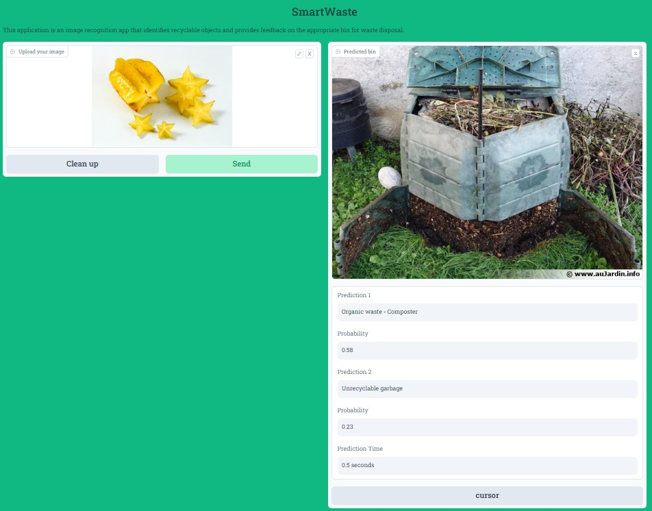

<div style="text-align:right">
    
</div>  

#
SmartWaste is a project that was developed as part of the DATA SCIENCE: DEEP LEARNING, COMPUTER VISION & NLP Bootcamp at ITC. It participated in a "Smart-Cities" Hackathon and won the 2nd place. The objective of the project is to implement an image recognition feature that allows users to take a photo of an item and receive instant feedback on whether it is recyclable or not and in which bin it should be disposed.

## Problem Statement

A common problem faced by individuals is the lack of knowledge regarding the recyclability of various objects and which bin they should be disposed into. This leads to confusion and improper waste management, which has a negative impact on the environment. SmartWaste aims to solve this problem by leveraging machine learning algorithms to analyze images and classify objects based on their recyclability.

## Data Science Approach

To tackle the problem, computer vision techniques were utilized to recognize different items in the images. The project employed a deep learning Convolutional Neural Network (CNN) model, specifically the VGG16 architecture, for image classification.

The VGG16 model, pre-trained on the ImageNet dataset, was used as the base model. All layers in the base model were frozen to retain the pre-trained weights and prevent overfitting. By doing so, the model could extract high-level features from the input images effectively.

Data augmentation techniques were applied to increase the diversity and size of the training dataset. The training data was subjected to random transformations, such as rotation, shifting, flipping, and brightness adjustments. These techniques helped improve the model's ability to generalize and handle variations in the input images.

The modified VGG16 model was fine-tuned by replacing the original classifier head with custom layers. The output layer consisted of 7 units, representing the 7 different bins for recycling. Softmax activation was used to produce probabilistic outputs, indicating the likelihood of an item belonging to each bin.

The model was trained using a total of 24,719 labeled images taken from the web. Each image was associated with one of the seven bins: Plastic bottles and steel cans (deposed in supermarkets for money), cardboard bins, glass purple bins, organic bins for composting, different grocery packages for the orange bin, paper for the blue bin, and unrecyclable garbage, according to the Israeli recycling system.

Link to the trained model:  
https://drive.google.com/file/d/1TJSpf9wJYZSqIm5ytqXkU8RLuKJmmHHa/view?usp=sharing

## Results

After training the model, it achieved an accuracy of 0.85 and a loss of 0.35. These metrics demonstrate the model's effectiveness in classifying objects based on their recyclability. The high accuracy suggests that the model can provide reliable feedback to users regarding the appropriate bin for waste disposal.

## Repository Structure

- `scripts`: Contains scripts for training the model and deploying the image recognition feature with a CLI and GUI.
- `Bins.json`: Contains the labels for the 7 different bins and urls for corresponding images.
- `examples`: Provides example images and instructions for running the image recognition feature.
- `requirements.txt`: Lists the required Python packages and dependencies for running the project.

## Usage

To use the SmartWaste image recognition feature, follow these steps:

### Command Line Usage

1. Install the required dependencies by running `pip install -r requirements.txt`.
2. Prepare an image to be classified. Ensure that the image is in JPEG format (.jpg/.jpeg) and the item is on a uniform background.
3. Navigate to the `scripts` folder in the repository.
4. Run the `predict.py` script using the following command:
```sh
python predict.py --image_path <path/to/image> [--is_url]
```
- Replace `<path/to/image>` with the path or URL of the image you want to classify.
- Use the `--is_url` flag if the image path is a URL. If the image is a local file path, you can omit this flag.
5. The script will analyze the image and output the predicted bin for waste disposal.

### Graphical User Interface (GUI) Usage

SmartWaste also provides a friendly GUI made with Gradio. Here's how you can use it:

1. Install the required dependencies by running `pip install -r requirements.txt`.
2. Navigate to the `scripts` folder in the repository.
3. Run the `app.py` script to launch the GUI:
```sh
python SmartWaste.py
```
5. Lunch the GUI by running the link provided as an ouput in the terminal by gradio.
6. Once the GUI has launched, upload the image you want to classify.
7. The application will analyze the image and display the predicted bin for waste disposal.

**Note:** The model will be downloaded automatically when you run the script for the first time. This may take a few minutes.

Feel free to explore the repository for additional functionalities and resources.

## Examples
### Command Line Usage


### SmartWaste app Usage 




## Acknowledgments

I would like to express my gratitude to the organizers of the Bootcamp at ITC for providing the platform to develop and showcase the project.


